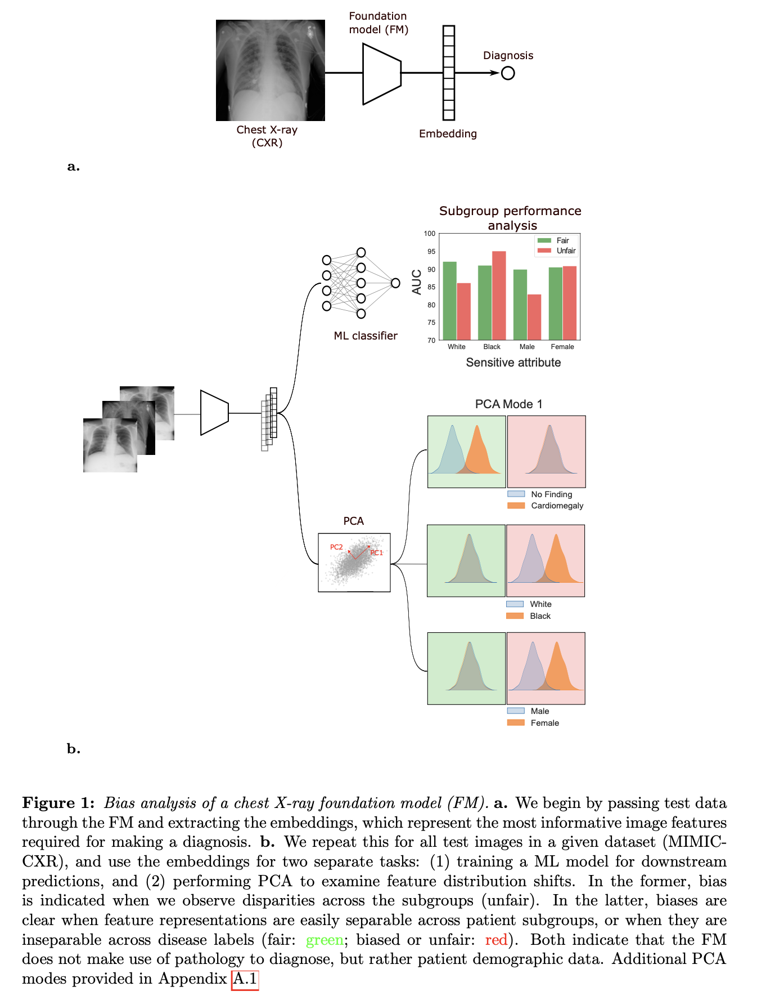
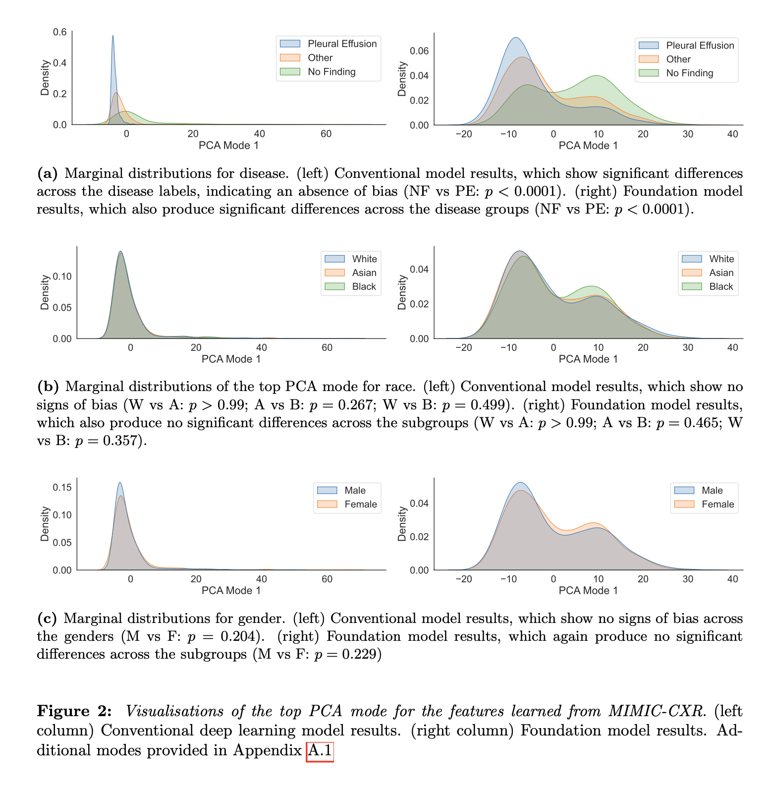
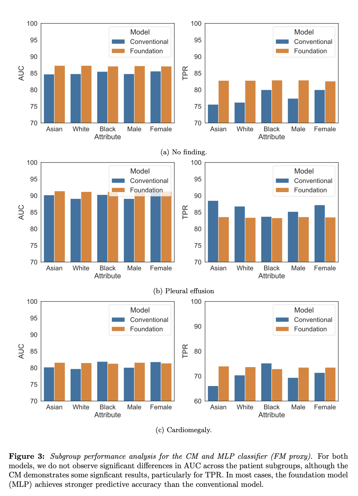

# Introduction

In this project, we implement a bias analysis within the context of foundation models (FMs) for chest radiography classification.

More details of the background and methodology are presented in the accompanying `bias_analysis.proposal.draft1.pdf` file.

# Results 
We present the main results to the bias analysis in Figures 2 (PCA visualisations) and 3 (generalisation performance).
For the PCA results, we are looking to demonstrate two key findings: (1) significant overlap- ping across our patient subgroups; and (2) significant differences across our disease labels. In the former, this demonstrates that the FM does not leverage sensitive attributes to dis- criminate between each pathology label; in the latter, non-overlapping support across the distributions suggests the model has learned to associate unique features to each pathology. For the performance analysis, our goal is to show no disparities across the patient subgroups, meaning we observe consistent performance no matter the demographic attributes of the patients.

# Conclusions
